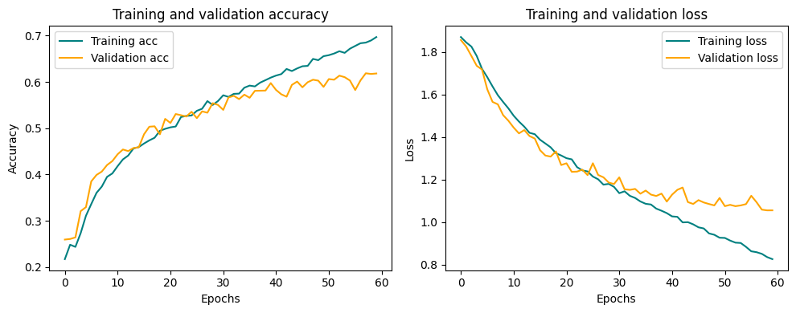

# Emotion Detection Using Convolutional Neural Networks (CNN)

## Overview

This project aims to classify human facial emotions into one of **seven categories** using deep Convolutional Neural Networks (CNN). The model is trained on the **FER-2013 dataset**, which was unveiled at the International Conference on Machine Learning (ICML). The dataset comprises 35887 grayscale facial images of size 48x48, representing **seven emotions**: anger, disgust, fear, happiness, neutral, sadness and surprise.

## Dependencies

* Python 3, [OpenCV](https://opencv.org/), [Tensorflow](https://www.tensorflow.org/)
* To install the required packages, execute: `pip install -r Requirements.txt`.

## Basic Usage Instructions

The repository is compatible with `tensorflow` and utilizes the Keras API via `tensorflow.keras`.

* Clone the repository and navigate to the directory:

```bash
git clone https://github.com/hoangtung719/Design_project_1.git
cd Design_project_1
```

* If you want to retrain the model, download the FER-2013 dataset from [here](https://www.kaggle.com/datasets/jonathanoheix/face-expression-recognition-dataset) and then save it to the `Source_code` directory.

* To train the model:

```bash
cd Source_code
jupyter notebook Model_training.ipynb
```

Execute all cells within the `Model_training.ipynb` file.

* To view predictions without retraining, download the pre-trained model from [here](https://drive.google.com/file/d/1MI3rygJUIFtyXGiEW4YGaPnMRT2mtV5T/view) and:

```bash
cd Source_code
jupyter notebook Model_testing.ipynb
```

Execute all cells within the `Model_testing.ipynb` file.

* Directory structure:

```
Source_code:
 - Model_training.ipynb (file)
 - Model_testing.ipynb (file)
 - haarcascade_frontalface_default.xml (file)
 - BeVietnamPro-Regular.ttf (file)
 - Emotion_recognition_model.h5 (file)
```

* By default, this implementation detects emotions on all faces from webcam feed. With a simple 4-layer CNN, an accuracy of 65.97% was achieved after 60 epochs.



## Data Preparation (Optional)

* [The original FER-2013 dataset on Kaggle](https://www.kaggle.com/datasets/deadskull7/fer2013) is available as a csv file. I have used a pre-converted image version for training/testing.

* For experimenting with new datasets, simply change the paths in `train_dir` and `val_dir`.

## Algorithm

* Faces are detected using the **haar Cascade** method from webcam feed.

* Detected faces are resized to **48x48** and converted to input for CNN.

* The network outputs a list of **softmax scores** for seven emotion categories.

* The emotion with the highest score is displayed on screen.

* The **BeVietnamPro-Regular.ttf** font is used to display Vietnamese emotions on screen.
